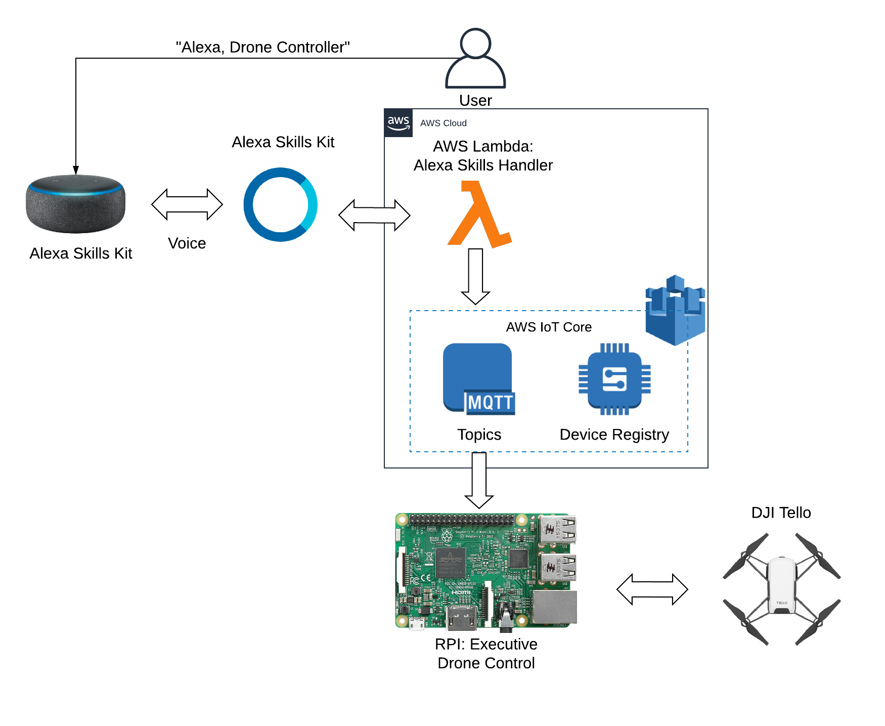

# Alexa Voice Controlled Drone
This project allows you to control a DJI Tello drone with your voice using alexa. 

# Tech Stack
- Raspberry Pi 4
- AWS
- AWS IoT Core
	- AWS IoT Device Registry 
- CanaKit RPI USB Wifi Dongle  
- DJI Tello
- Python 
- ASK (Alexa Skills Kit) 
- AWS Lambda

# How does it work?
- A user invokes the alexa skill by saying `alexa drone controller`
- The ASK responds with a tutorial on how to use the skills kit and then waits for the user to respond with a command. 
- Once a command is sent and received successfully, the skills kit will wait until another command is sent or until it is told to quit.  

----------------------------------
When a user sends a command:
1. A lambda function behind the alexa skills kit processes the commands sent by the user and publishes them to the Rasberry Pi.
      * AWS IoT Core sits between the lambda function and the raspberry pi to facilitate secure communication over MQTT.
2. The lambda function publishes the commands to a MQTT topic, and the raspberry pi(which is subscribed to the topic): receives the commands from the lambda function.
3. **Raspberry Pi 4 (connected to the drone via wifi)**
      * A python script on the RPI receives the commands from the MQTT topic and sends them to the DJI Tello.
      

# Video Demo 

Checkout this link to see this project in action! 

   

